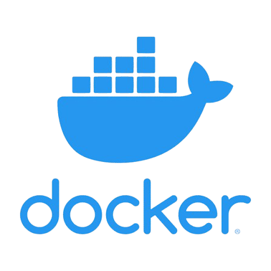
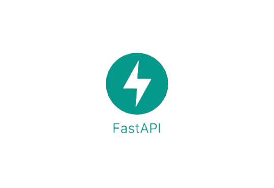

<!-- Your Custom Generated Capsule Render Banner -->

 

---

## 👨‍💻 About Me

<table border="0">
  <tr>
    <td width="60%" valign="top">
      <ul>
        <li>🚀 I'm a <b>Python & Backend Developer</b> specializing in microservices, NLP vector search architectures, and blockchain-secured systems.</li>
        <li>🌱 Currently diving deep into <b>FastAPI, Elasticsearch, Docker, and Database Scaling</b>.</li>
        <li>💡 Love exploring semantic search matching pipelines and complex backend infrastructure optimizations.</li>
        <li>🎯 <b>2026 Goals</b>: Refine large index querying performance and contribute actively to robust open-source project frameworks.</li>
        <li>💬 Ask me about <b>Python, Backend Architecture, PostgreSQL, and Data Engineering</b>.</li>
        <li>📫 Reach me at: <a href="mailto:suryajithshibu2480@gmail.com"><b>suryajithshibu2480@gmail.com</b></a></li>
        <li>⚡ Fun fact: I debug my code by explaining it line-by-line to an empty coffee mug!</li>
        <li>🌍 Based in <b>India 🇮🇳</b></li>
      </ul>
    </td>
    <td width="40%" valign="top" align="center">
      <!-- High-Quality Native Giphy Workspace Asset -->
      
    </td>
  </tr>
</table>

---

## 🌐 Connect with Me

 

&nbsp;&nbsp;&nbsp;&nbsp;&nbsp;&nbsp;&nbsp;&nbsp;&nbsp;&nbsp;&nbsp;&nbsp;

---

## 🛠️ Tech Stack & Tools

###  💻  Languages & Frameworks
&nbsp;&nbsp;&nbsp;&nbsp;&nbsp;&nbsp;&nbsp;&nbsp;&nbsp;&nbsp;&nbsp;&nbsp;&nbsp;&nbsp;&nbsp;&nbsp;&nbsp;&nbsp;

### 🗄️ Databases & Cloud
&nbsp;&nbsp;&nbsp;&nbsp;&nbsp;&nbsp;&nbsp;&nbsp;&nbsp;&nbsp;&nbsp;&nbsp;

### ⚙️ DevOps & Tools
&nbsp;&nbsp;&nbsp;&nbsp;&nbsp;&nbsp;&nbsp;&nbsp;&nbsp;&nbsp;&nbsp;&nbsp;

### 🚀 Frameworks & Libraries
&nbsp;&nbsp;&nbsp;&nbsp;&nbsp;&nbsp;

----

# 📊 GitHub Stats:

 

 

---

## 📈 Contribution Activity Graph

---
### ✍️ My Point Of View

✨ Show some ❤️ by starring repositories you find interesting! ✨

---

